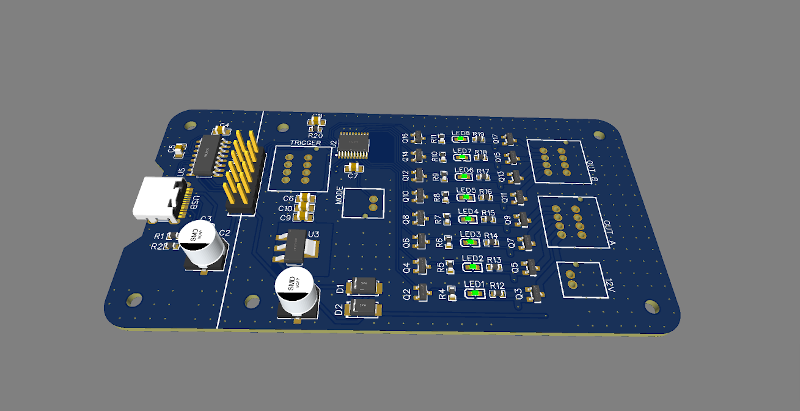

# The Practical Hardware Design Guide: MSP430

[MSP430™][msp430] is a 16-bit microcontrollers of Texas Instruments.
In this tutorial, we will create a basic hardware for controlling LED strip.

## 1. Designing the Hardware

### The microcontroller

We will use MSP430G2553, with 512B of RAM and 16kB of Flash program memory.
This is sufficient for implementing many features, such as I2C OLED display driving, rotary encoder interfacing, motor control, etc.

Some variants of MSP430 has very small RAM. For example, MSP430G2211 has only 128B of RAM.
For simple LED blinking and PWM controls, this may be enough.
But for more advanced jobs such as OLED display control and interfacign I2C sensors, it's common to exceed the RAM usage.
When building binary files in Energia or CCS IDE, the RAM and ROM usage is printed out. But if you're still in the early stage of firmware development or you're not sure how much RAM it will use, just try to use the higest model of MSP430 available.

As we will use USB-serial converter for programming the MCU in this tutorial, we need to choose an MCU with serial bootloader.
Most of the MSP430 has serial bootloader on ROM, called ROM-BSL.
But not all the MSP430 have it.
Some very low-end variants like MSP430G2211 has not ROM-BSL feature.
For these chips, 2-wire Spy-Bi interface can be used with a dedicated programmer/debugger like MSP430UIF.

For MSP430, choosing delay capacitor (C1 on the diagram) is important.
If this capacitor value is too big, the Spy-Bi-Wire cannot work, becuase the same pin is used for data line in debug mode.
The recommended values are 1nF for 10k pull-up resistor.

Another common mistake is wiring USB-serial converter's RX to MSP430's TX pin (P1.2 of MSP430G2553).
This is valid for using UART communication.
But for ROM-BSL, different pin (P1.5 of MSP430G2553) must be used.

__Section checklist__:
* Available RAM/ROM size of MCU
* Presence of ROM-BSL functionality of MCU
* The right value of pull-up resistor and delay capacitor
* RX/TX wiring for ROM-BSL usage

### USB Programming interface

There are several common USB-serial interface controller ICs, such as FT232, CP2101, PL2303, CH340.
The ROM-BSL feature requires 4 pins - TX, RX, DTR, RTS.
Note that not all USB-serial converter chips have all these pins available.
For example, some CH340 and PL2303 variants do not have DTR or RTS pins.

CH340C and CH340B both have all the 4 pins. But as CH340C requires external crystal ocilator, we'll use CH340B for this example design.

USB Type-C port is widely used to replace the legacy USB micro-B and mini-B ports.
In practice USB-C ports are more strong mechanically.
When using USB Type-C port, be sure to use pull-down resistors for CC pins.
These pins are used to tell the USB PD supply to get 5V power.
Without these pull down resistors, the board cannot be powered from USB-PD type supplies such as mobile phone chargers.

__Section checklist__:
* Availability of all 4 pins - RX, TX, DTR, RTS
* Pull-down resistors on USB Type-C's CC pins

### Power supply and IO

Some PIC or AVR microcontrollers work for wide power voltage range, e.g. 2~5.5V.
But all MSP430 microcontrollers work only under 3.3V and doesn't accept 5V VCC.
Make sure to use some 3.3V LDO or switching power supply.

Because the VCC is 3.3V, all the IO levels are 3.3V.
This may be a problem for driving high-current MOSFETs directly.
For example, to make a 50N06 (50A, 60V N-Channel MOSFET) fully open, the gate voltage should be greater than 5V.
In this case, need to use a small MOSFET (e.g. 2n7002) for driving high current MOSFET.

__Section checklist__:
* 3.3V power supply
* All I/O must be compitible with 3.3V

## 2. Full Design Example

Here are full design files in EasyEDA format for a LED lighing controller board as an example.
* [Schematics](./hardware/msp430/SCH_MSP430-Tutorial_2022-03-29.json)
* [PCB](./hardware/msp430/PCB_PCB_2022-03-29.json)

## 3. Prototyping with SMT Assembly Service

These are teh fabrication files that can be directly uploaded to [JLCPCB][jlcpcb]'s online ordering form. These files can be exported from EasyEDA's __Fabrication__ menu after editign the designs.
* [Geber](./hardware/msp430/fabrication/Gerber_PCB.zip)
* [BOM](./hardware/msp430/fabrication/BOM_PCB_2022-03-29.csv)
* [CPL](./hardware/msp430/fabrication/PickAndPlace_PCB_2022-03-29.csv)

Here's the PCBA result from [JLCPCB][jlcpcb] SMT Assembly service.
At the time of this writing, making 10 fully-assembled boards from JLCPCB costed less than 58USD including shipping, that is $6 per board.
For mass qty like 100pcs or 500pcs, the unit cost will be decreased more.

<table>
<tr></tr>
<tr><td></td><td></td></tr>
</table>

---

[msp430]: https://www.ti.com/microcontrollers-mcus-processors/microcontrollers/msp430-microcontrollers/overview.html "MSP430 Microcontrollers"
[jlcpcb]: https://jlcpcb.com/HOT "JLCPCB Official Website"
